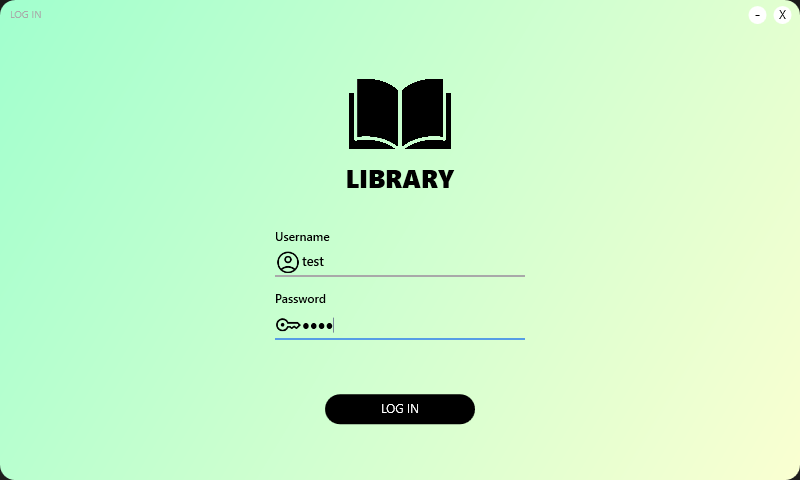
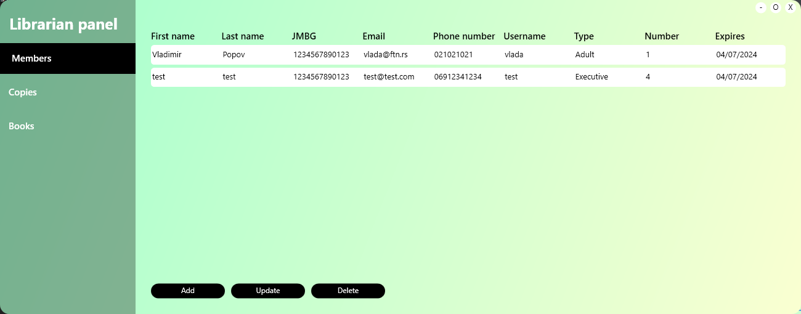
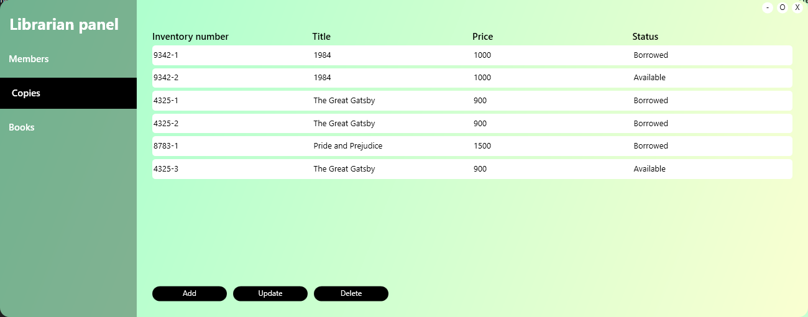
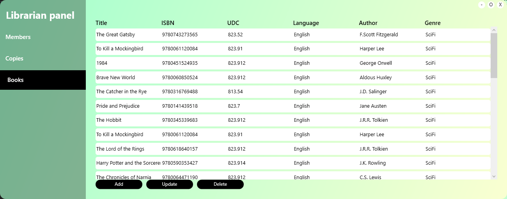
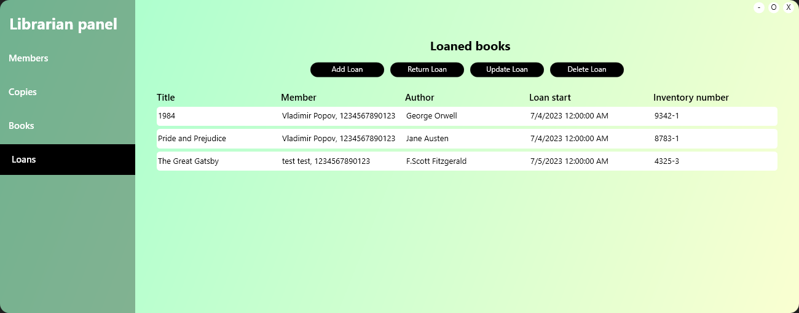
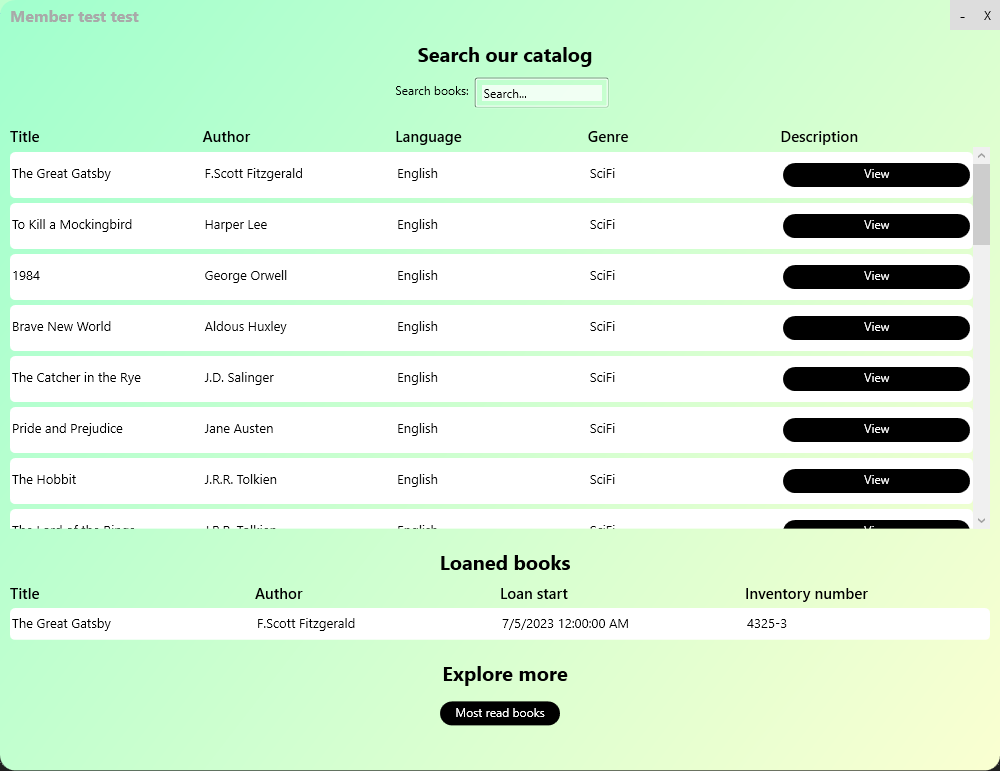
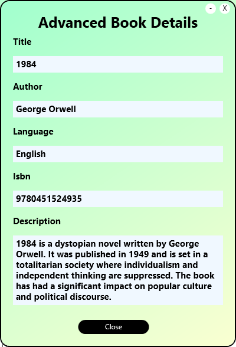
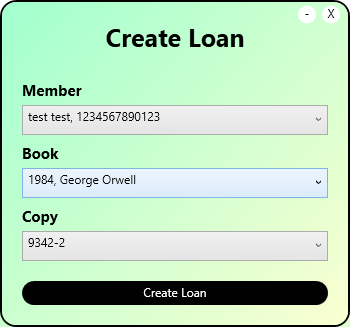
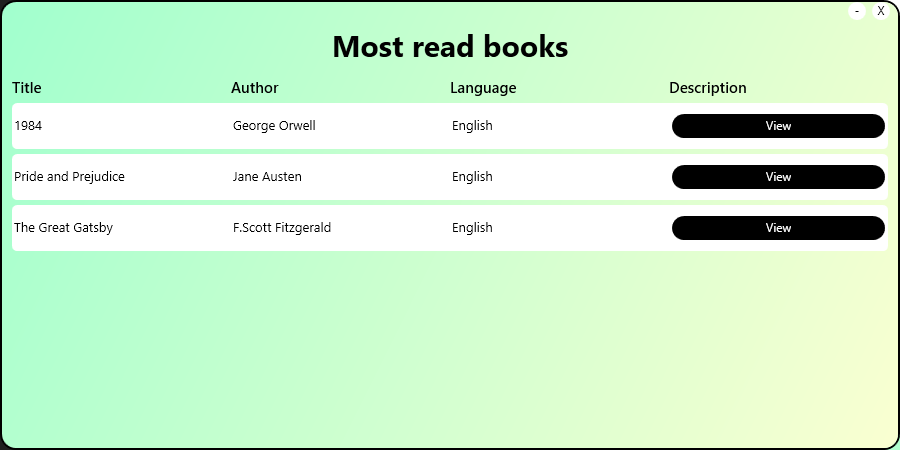

# Predmetni projekat iz predmeta SIMS

    Implementacija projektnog zadatka radjena je u C# jeziku, oslanjajuci se pretezno 
    na MVVM sablon u WPF-u

    Aplikaciji je moguce pristupiti preko dve razlicite uloge:
      - Bibliotekar
      - Clan

    Implementirane funkcionalnosti: 
      - logovanje na sistem
      - CRUD knjiga
      - CRUD primeraka knjiga
      - CRUD clanova biblioteke
      - CRUD pozajmica
      - Izvestaj top 10 najcitanijih knjiga

## Logovanje na sistem
    Logovanje se vrsi preko jednostavne forme u kojoj se zahteva unos korisnickog imena i lozinke

  

## Bibliotekar:
    Ukoliko je ulogovani korisnik bibliotekar, funkcionalnosti koje on moze da izvrsava su vezane za 
    upravljanje clanovima biblioteke, upravljanje katalogom i upravljanje pozajmicama
    
### Izgled prozora bibiliotekara:

  
  
  
  

## Clan
    Ukoliko je ulogovani korisnik clan biblioteke, funkcionalnosti koje on moze da izvrsava su vezane za 
    pretragu kataloga, pregled iznajmljenih knjiga, kao i uvid u najcitanije naslove biblioteke

### Izgled prozora clana biblioteke:

  

## Primer detaljnog prikaza informacija o knjizi i kreiranje pozajmice:

  
  

## Prikaz najcitanijih naslova:

  

